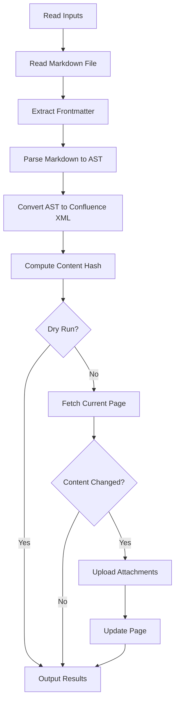

## Project Structure

```
confluence-md/
├── src/
│   ├── main.ts              # Entry point, orchestrates the flow
│   ├── types.ts             # TypeScript interfaces
│   ├── inputs.ts            # GitHub Action input handling
│   ├── frontmatter.ts       # YAML frontmatter extraction
│   ├── images.ts            # Image path utilities
│   ├── converter/
│   │   ├── index.ts         # Unified processor pipeline
│   │   ├── nodes.ts         # AST node converters
│   │   └── xml.ts           # XML utilities
│   └── confluence/
│       ├── client.ts        # HTTP client wrapper
│       ├── pages.ts         # Page API operations
│       └── attachments.ts   # Attachment handling
├── tests/                   # Vitest test suites
├── dist/                    # Bundled output (ncc)
└── action.yml               # GitHub Action metadata
```

## Execution Flow



## Key Modules

### Input Handling (`src/inputs.ts`)

Reads and validates GitHub Action inputs:
- Normalizes the Confluence base URL (removes trailing slashes)
- Sets default values for optional inputs
- Validates required inputs are present

### Frontmatter (`src/frontmatter.ts`)

Uses `gray-matter` to extract YAML frontmatter:
- Parses the frontmatter block
- Extracts the page ID using the configured key
- Returns both metadata and content body

### Converter (`src/converter/`)

#### `index.ts`
Creates the unified processing pipeline:
```
remark-parse → remark-gfm → custom converter → Confluence XML
```

Tracks images found during conversion for later upload.

#### `nodes.ts`
Recursive AST node converters handling:
- Block elements (paragraphs, headings, lists, tables)
- Inline elements (bold, italic, code, links)
- Special elements (code blocks, images, Mermaid)

#### `xml.ts`
XML utilities:
- `escapeXml()` - Escape special characters
- `cdata()` - Wrap content in CDATA sections
- `el()` - Create XML elements
- `macro()` - Create Confluence macro elements

### Confluence Client (`src/confluence/`)

#### `client.ts`
HTTP client wrapper using `@actions/http-client`:
- Basic authentication (email:token)
- JSON request/response handling
- Multipart form data for attachments

#### `pages.ts`
Page operations using Confluence v2 API:
- `getPage()` - Fetch page with storage body
- `updatePage()` - Update page content and version

#### `attachments.ts`
Attachment handling using Confluence v1 API:
- `uploadAttachment()` - Upload file as attachment
- `downloadImage()` - Download remote images

## API Versions

The action uses different Confluence API versions:

| API | Version | Endpoint Pattern |
|-----|---------|------------------|
| Pages | v2 | `/wiki/api/v2/pages/{id}` |
| Attachments | v1 | `/wiki/rest/api/content/{id}/child/attachment` |

The v2 API is used for pages because it provides cleaner JSON responses. The v1 API is used for attachments because attachment upload isn't available in v2.

## Content Hashing

To enable `skip_if_unchanged`, the action:
1. Computes SHA256 hash of the generated storage format
2. Truncates to first 16 characters
3. Compares with hash stored in page properties (if available)
4. Skips update if hashes match

## Build Process

The project uses `@vercel/ncc` to bundle all dependencies into a single file:

```bash
npm run build  # Outputs to dist/index.js
```

This creates a self-contained bundle that doesn't require `node_modules` at runtime.
