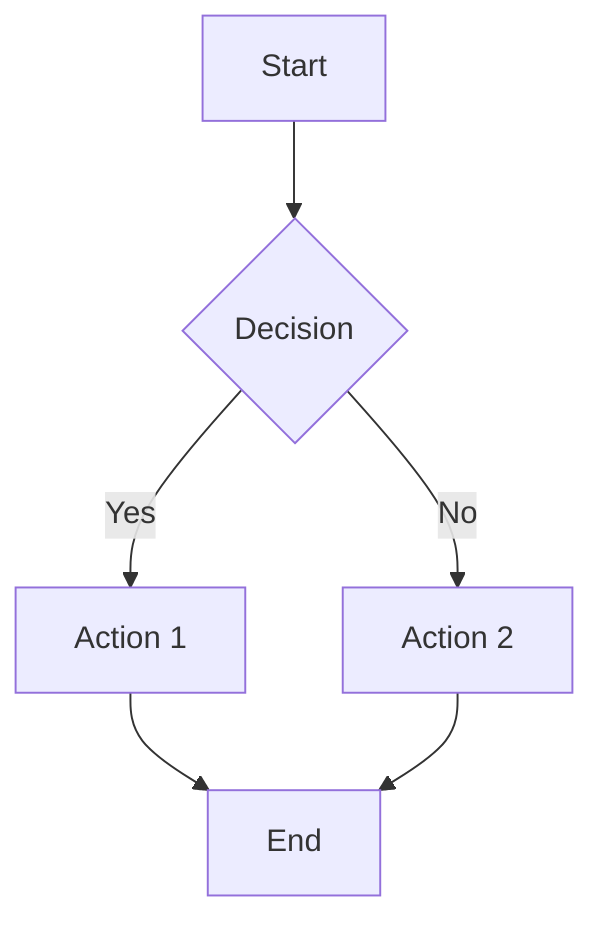
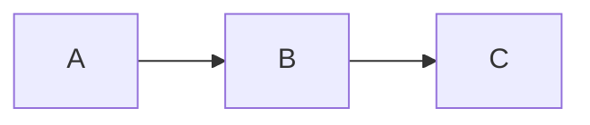
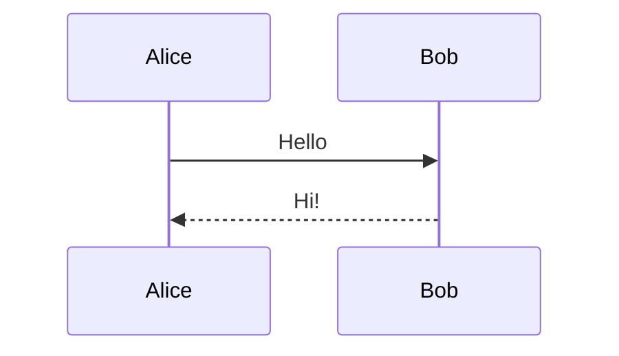
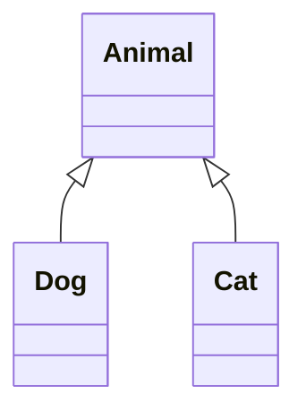
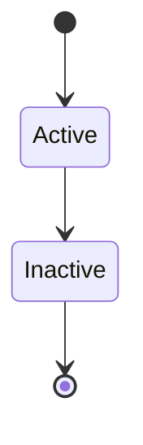
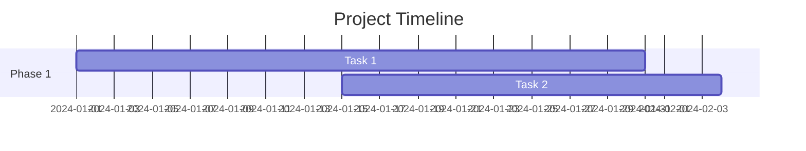
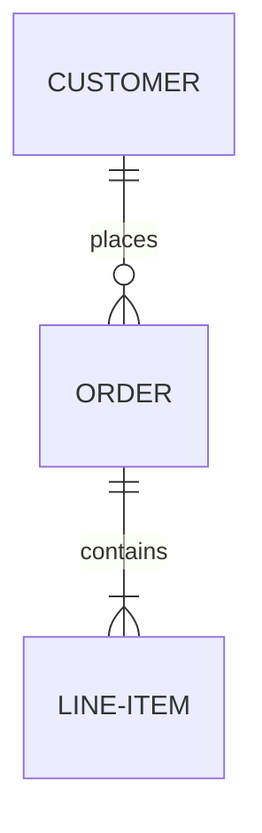

The action automatically converts Mermaid code blocks to Confluence's Mermaid macro.

## Requirements

Your Confluence instance must have the **Mermaid Diagrams** app installed. This is available in the Atlassian Marketplace.

## Basic Usage

Simply use a fenced code block with `mermaid` as the language:

````markdown

````

This converts to:

```xml
<ac:structured-macro ac:name="mermaid">
  <ac:plain-text-body><![CDATA[graph TD
    A[Start] --> B{Decision}
    B -->|Yes| C[Action 1]
    B -->|No| D[Action 2]
    C --> E[End]
    D --> E]]></ac:plain-text-body>
</ac:structured-macro>
```

## Supported Diagram Types

All Mermaid diagram types are supported, including:

### Flowcharts

````markdown

````

### Sequence Diagrams

````markdown

````

### Class Diagrams

````markdown

````

### State Diagrams

````markdown

````

### Gantt Charts

````markdown

````

### Entity Relationship Diagrams

````markdown

````

## Troubleshooting

### Diagram Not Rendering

1. Verify the Mermaid app is installed in your Confluence instance
2. Check the diagram syntax using the [Mermaid Live Editor](https://mermaid.live/)
3. Ensure there are no extra spaces before the closing backticks

### Complex Diagrams

For very complex diagrams, consider:
- Breaking them into smaller diagrams
- Using the Mermaid app's native editor in Confluence for fine-tuning
- Testing the diagram in Mermaid Live Editor first
