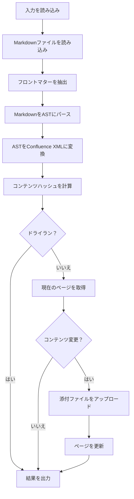

## プロジェクト構造

```
confluence-md/
├── src/
│   ├── main.ts              # エントリーポイント、フローの調整
│   ├── types.ts             # TypeScriptインターフェース
│   ├── inputs.ts            # GitHub Action入力処理
│   ├── frontmatter.ts       # YAMLフロントマター抽出
│   ├── images.ts            # 画像パスユーティリティ
│   ├── converter/
│   │   ├── index.ts         # Unifiedプロセッサパイプライン
│   │   ├── nodes.ts         # ASTノードコンバーター
│   │   └── xml.ts           # XMLユーティリティ
│   └── confluence/
│       ├── client.ts        # HTTPクライアントラッパー
│       ├── pages.ts         # ページAPI操作
│       └── attachments.ts   # 添付ファイル処理
├── tests/                   # Vitestテストスイート
├── dist/                    # バンドル出力（ncc）
└── action.yml               # GitHub Actionメタデータ
```

## 実行フロー



## 主要モジュール

### 入力処理 (`src/inputs.ts`)

GitHub Action入力を読み取り、検証します：
- ConfluenceベースURLを正規化（末尾のスラッシュを削除）
- オプション入力のデフォルト値を設定
- 必須入力が存在することを検証

### フロントマター (`src/frontmatter.ts`)

`gray-matter`を使用してYAMLフロントマターを抽出：
- フロントマターブロックをパース
- 設定されたキーを使用してページIDを抽出
- メタデータとコンテンツ本文の両方を返す

### コンバーター (`src/converter/`)

#### `index.ts`
unified処理パイプラインを作成：
```
remark-parse → remark-gfm → カスタムコンバーター → Confluence XML
```

後でアップロードするために変換中に見つかった画像を追跡します。

#### `nodes.ts`
再帰的ASTノードコンバーターが処理：
- ブロック要素（段落、見出し、リスト、テーブル）
- インライン要素（太字、斜体、コード、リンク）
- 特殊要素（コードブロック、画像、Mermaid）

#### `xml.ts`
XMLユーティリティ：
- `escapeXml()` - 特殊文字をエスケープ
- `cdata()` - コンテンツをCDATAセクションでラップ
- `el()` - XML要素を作成
- `macro()` - Confluenceマクロ要素を作成

### Confluenceクライアント (`src/confluence/`)

#### `client.ts`
`@actions/http-client`を使用したHTTPクライアントラッパー：
- Basic認証（email:token）
- JSONリクエスト/レスポンス処理
- 添付ファイル用マルチパートフォームデータ

#### `pages.ts`
Confluence v2 APIを使用したページ操作：
- `getPage()` - ストレージ本文付きでページを取得
- `updatePage()` - ページコンテンツとバージョンを更新

#### `attachments.ts`
Confluence v1 APIを使用した添付ファイル処理：
- `uploadAttachment()` - ファイルを添付ファイルとしてアップロード
- `downloadImage()` - リモート画像をダウンロード

## APIバージョン

Actionは異なるConfluence APIバージョンを使用：

| API | バージョン | エンドポイントパターン |
|-----|-----------|----------------------|
| ページ | v2 | `/wiki/api/v2/pages/{id}` |
| 添付ファイル | v1 | `/wiki/rest/api/content/{id}/child/attachment` |

v2 APIはよりクリーンなJSONレスポンスを提供するためページに使用。v1 APIは添付ファイルのアップロードがv2で利用できないため使用。

## コンテンツハッシュ

`skip_if_unchanged`を有効にするため、Actionは：
1. 生成されたストレージ形式のSHA256ハッシュを計算
2. 最初の16文字に切り詰め
3. ページプロパティに保存されたハッシュと比較（利用可能な場合）
4. ハッシュが一致する場合は更新をスキップ

## ビルドプロセス

プロジェクトは`@vercel/ncc`を使用してすべての依存関係を単一ファイルにバンドル：

```bash
npm run build  # dist/index.jsに出力
```

これにより、実行時に`node_modules`を必要としない自己完結型バンドルが作成されます。
