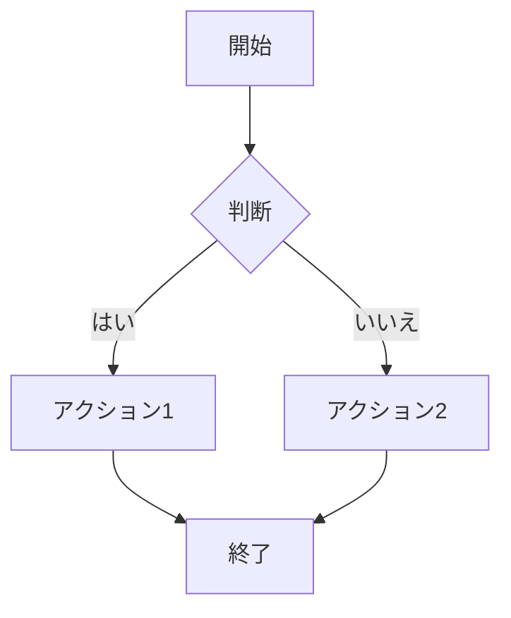
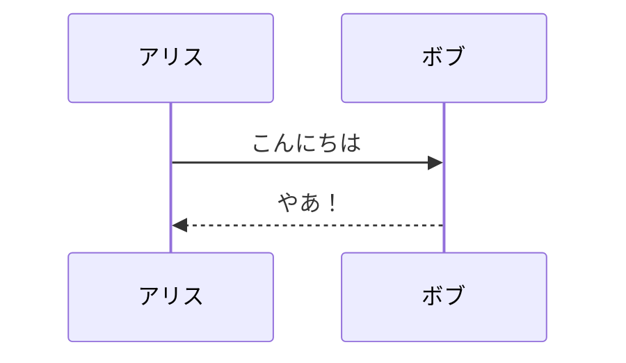
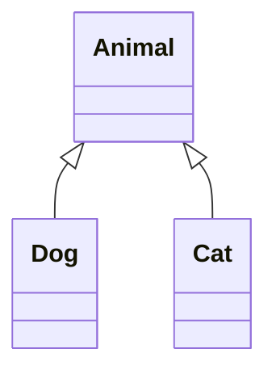
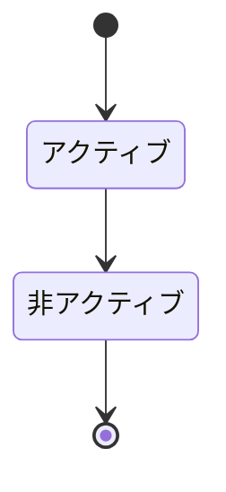
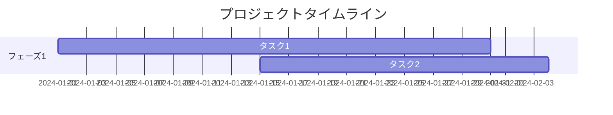
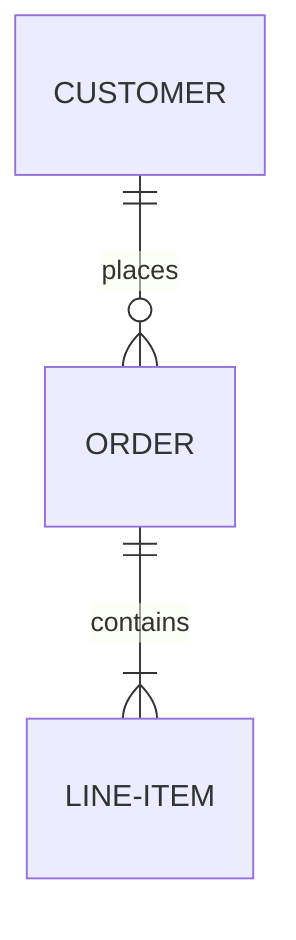

ActionはMermaidコードブロックをConfluenceのMermaidマクロに自動変換します。

## 必要条件

Confluenceインスタンスに**Mermaid Diagrams**アプリがインストールされている必要があります。これはAtlassian Marketplaceで入手できます。

## 基本的な使い方

言語として`mermaid`を指定したフェンスコードブロックを使用：

````markdown

````

これは以下に変換されます：

```xml
<ac:structured-macro ac:name="mermaid">
  <ac:plain-text-body><![CDATA[graph TD
    A[開始] --> B{判断}
    B -->|はい| C[アクション1]
    B -->|いいえ| D[アクション2]
    C --> E[終了]
    D --> E]]></ac:plain-text-body>
</ac:structured-macro>
```

## サポートされる図の種類

すべてのMermaid図タイプがサポートされています：

### フローチャート

````markdown

````

### シーケンス図

````markdown

````

### クラス図

````markdown

````

### 状態図

````markdown

````

### ガントチャート

````markdown

````

### ER図

````markdown

````

## トラブルシューティング

### 図がレンダリングされない

1. ConfluenceインスタンスにMermaidアプリがインストールされているか確認
2. [Mermaid Live Editor](https://mermaid.live/)で図の構文を確認
3. 閉じバッククォートの前に余分なスペースがないか確認

### 複雑な図

非常に複雑な図の場合は、以下を検討：
- 小さな図に分割
- ConfluenceのMermaidアプリネイティブエディタで微調整
- まずMermaid Live Editorで図をテスト
