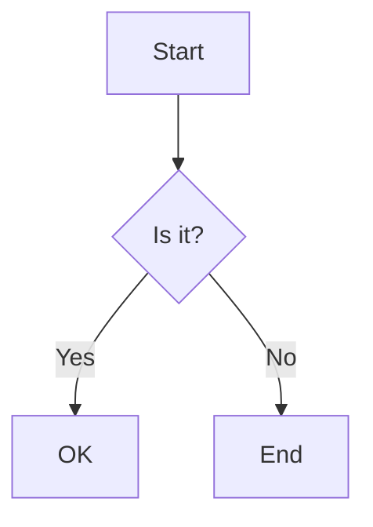

# Sample Markdown

This is a **bold** and *italic* text with `inline code`.

## Lists

### Unordered

- Item 1
- Item 2
- Item 3

### Ordered

1. First
2. Second
3. Third

### Task List

- [ ] Todo item
- [x] Done item

## Code Block

```javascript
function greet(name) {
  console.log(`Hello, ${name}!`);
}
```

## Mermaid Diagram



## Table

| Name | Age | City |
| --- | --- | --- |
| Alice | 30 | Tokyo |
| Bob | 25 | Osaka |

## Links and Images

[Example Link](https://example.com)


> This is a blockquote.

---

End of document.
